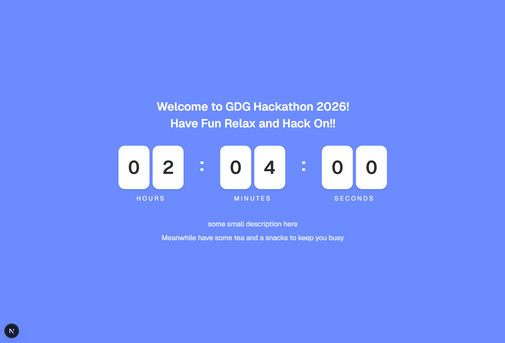
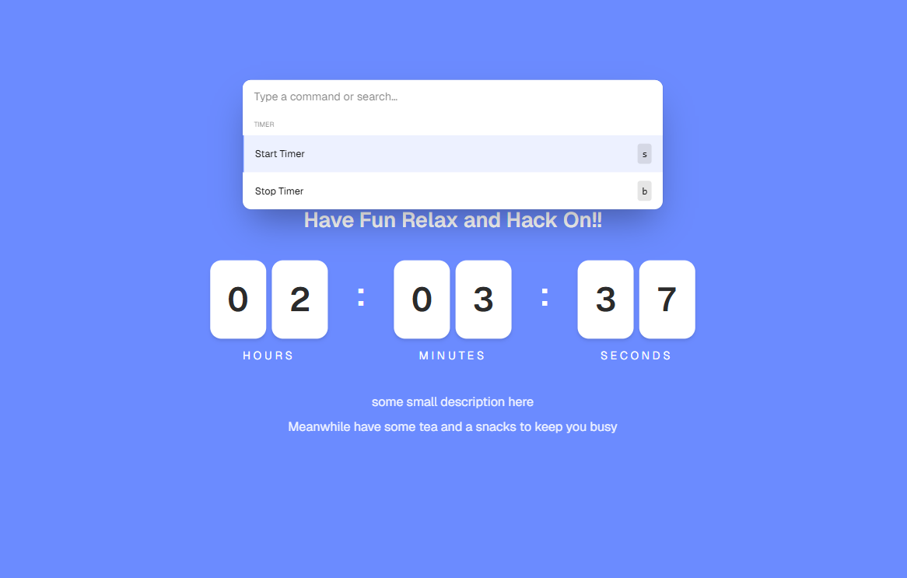

# ELTE GDG TIMER

This is work in progress for now



We have a bar similar to the one on a macbook XD to control the timer and set the time



| Side note: ctrl + k (windows) cmd + k (mac) to open the bar

## DEV STUFF

First, run the development server:

```bash
npm run dev
# or
yarn dev
# or
pnpm dev
# or
bun dev
```

Open [http://localhost:3000](http://localhost:3000) with your browser to see the result.

| Made with ❤ by Ali
